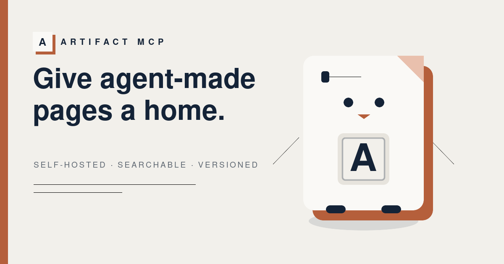

# artifact-mcp

> A self-hosted MCP server and gallery for HTML made by AI agents.

[](LICENSE)


[](https://artifact-mcp.neilblackman.dev)

[Website](https://artifact-mcp.neilblackman.dev) | [Documentation](docs/README.md) | [Latest release](https://github.com/AgentShelf-OSS/artifact-mcp/releases/latest) | [AgentShelf.ai](https://agentshelf.ai)

Agents already generate dashboards, reports, one-pagers, and small websites. Artifact MCP gives
those pages stable URLs on infrastructure you control. It keeps them searchable, versioned, and
ready for human review after the chat that created them has ended.

The production server is one Rust and Axum container backed by SQLite and ordinary files. Agents
publish through MCP. People browse an organization-scoped gallery behind Cloudflare Access, leave
feedback on exact points or regions, inspect older revisions, and create revocable public links.

## What it handles

- Publish a self-contained HTML page or a multi-file bundle through MCP.
- Update an artifact without changing its URL, with retained revision history and restore.
- Search and organize artifacts by organization, category, owner, review state, and visibility.
- Attach threaded feedback to a point or region and copy the exact revision context back to an
  agent.
- Keep organizations isolated with scoped publisher keys and verified viewer identity.
- Run optional Discord notifications, persistent thumbnails, OAuth credentials, and Prometheus
  metrics without making them requirements for the core server.

## Quick start

Docker and Docker Compose are required. Start with the full [getting started guide](GETTING_STARTED.md)
if this is your first installation.

```bash
git clone https://github.com/AgentShelf-OSS/artifact-mcp.git
cd artifact-mcp
cp .env.example .env
```

Set a long bootstrap key in `.env`:

```dotenv
ARTIFACT_API_KEYS=agent1:local:REPLACE_WITH_A_LONG_RANDOM_SECRET
```

For a loopback-only local gallery, set `TRUST_ACCESS_HEADERS=1`. Never use that setting on a
reachable origin. Then start the native server:

```bash
docker compose up -d --build
```

Publish a first artifact:

```bash
export KEY=REPLACE_WITH_A_LONG_RANDOM_SECRET
curl -H "Authorization: Bearer $KEY" -H 'content-type: application/json' \
  -d '{"jsonrpc":"2.0","id":1,"method":"tools/call","params":{"name":"publish_artifact",
       "arguments":{"html":"<h1>hi</h1>","title":"Demo","description":"first artifact"}}}' \
  http://localhost:3480/mcp
```

The response includes the artifact ID and URL. The [getting started guide](GETTING_STARTED.md)
continues through local gallery access, organization setup, and a production Cloudflare deployment.

## Screenshots

| Artifact library | Anchored review |
|---|---|
| [](docs/screenshots/01-gallery-admin-grid.png) | [](docs/screenshots/05-viewer-feedback.png) |
| Search, filter, sort, and switch layouts without losing the collection context. | Leave threaded feedback on a point or region and copy its revision context for an agent. |

| Version history | Organization settings |
|---|---|
| [](docs/screenshots/06-viewer-history.png) | [](docs/screenshots/07-admin-organizations.png) |
| Open retained revisions or restore one as a new revision at the same stable URL. | Manage tenant membership, routing, categories, colors, and delivery settings. |

[View all eight product screenshots](docs/screenshots/README.md).

## How it works

```text
Agent  -> POST /mcp ------------------------+
                                                |
Human  -> gallery, viewer, settings --------+--> Artifact MCP --> SQLite + files
                                                |
Public -> /s/:token read-only share --------+
```

Agents authenticate with a scoped API key or OAuth bearer token. Human routes use a verified
Cloudflare Access identity. Only an active `/s/:token` share is public. Uploaded HTML runs in a
sandboxed iframe, separate from the trusted gallery and review controls.

Artifact MCP supports the stateful MCP `2025-06-18` contract and the stateless `2026-07-28`
contract. Modern clients can negotiate typed outputs, resources, MCP Apps, and durable preview
tasks. See the [MCP API reference](docs/mcp-api.md) for the complete tool catalog.

## Is it a fit?

Artifact MCP makes sense when a team wants a durable artifact library, organization boundaries,
review history, and control of the deployment. A hosted one-page publisher is simpler when all you
need is one temporary URL. The [comparison guide](docs/comparison.md) spells out that distinction.

## Documentation

- [Documentation index](docs/README.md)
- [Getting started](GETTING_STARTED.md)
- [MCP API and tools](docs/mcp-api.md)
- [Configuration reference](docs/configuration.md)
- [Architecture and routes](docs/architecture.md)
- [Security model](docs/security.md)
- [Cloudflare deployment](docs/DEPLOY-CLOUDFLARE.md)
- [Operations runbooks](docs/README.md#operations)
- [Release notes](docs/releases/README.md)

## Contributing

Issues, ideas, and focused pull requests are welcome. Read [CONTRIBUTING.md](CONTRIBUTING.md)
before starting a substantial change. Report vulnerabilities through the private process in
[SECURITY.md](SECURITY.md), not a public issue.

## Roadmap

- Full-text search across artifact bodies
- More precise cooperative anchors and text-range highlights
- Per-key quotas and artifact expiry
- Optional content scanning and a separate artifact-delivery origin

## License

Apache License 2.0. See [LICENSE](LICENSE) and [NOTICE](NOTICE).
