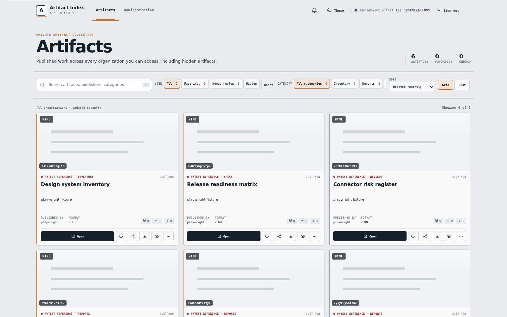
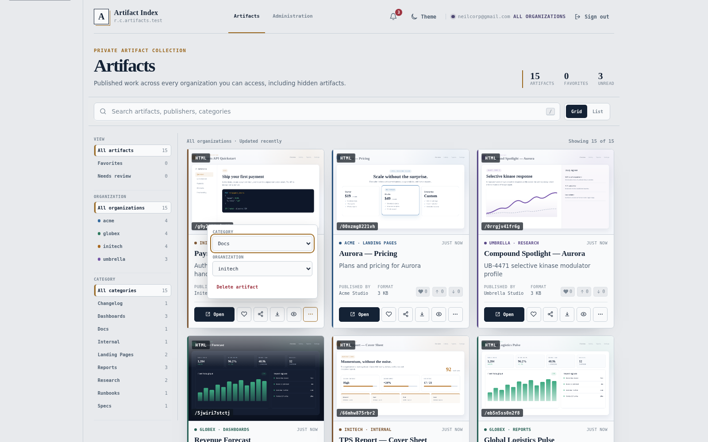
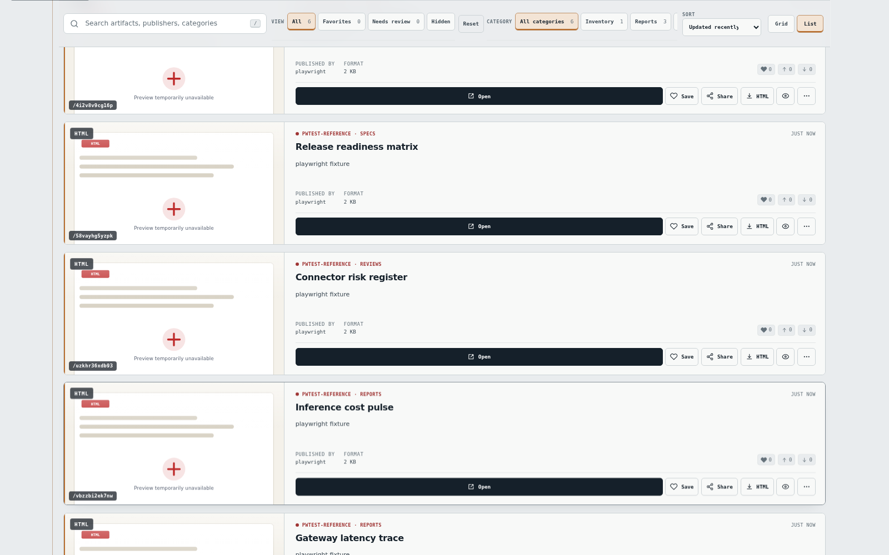
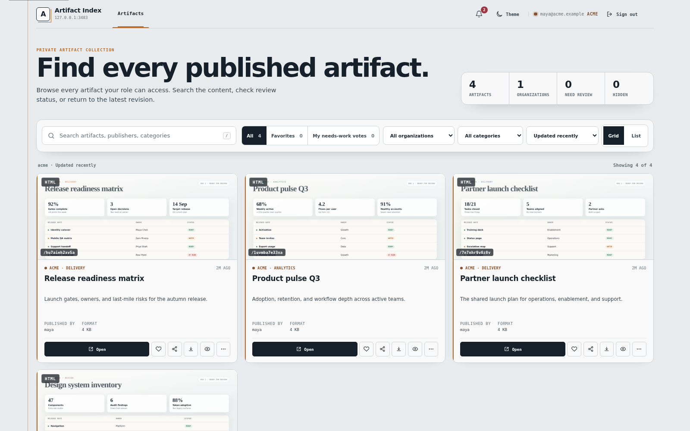
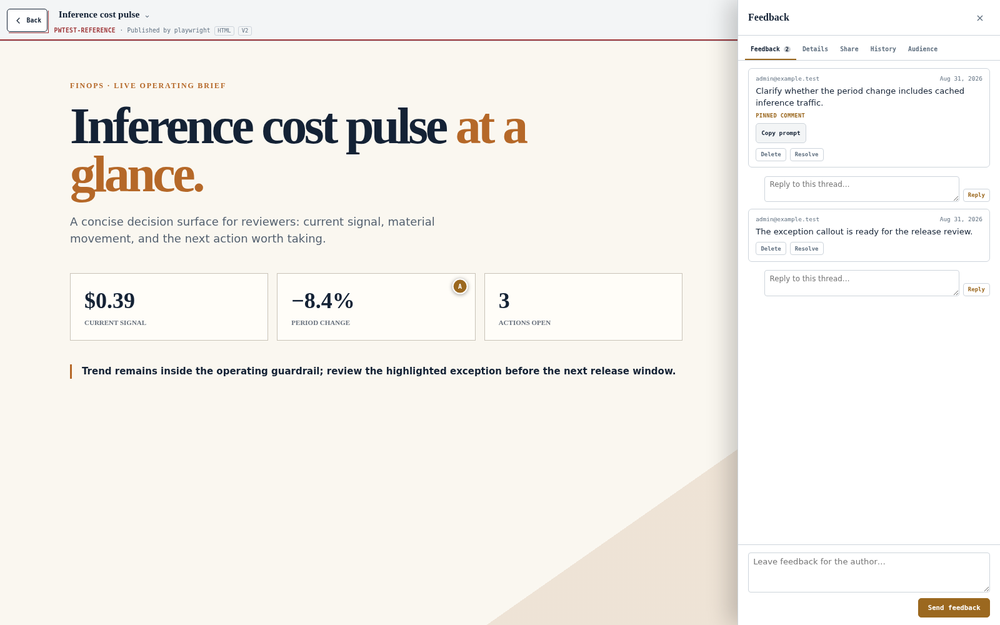
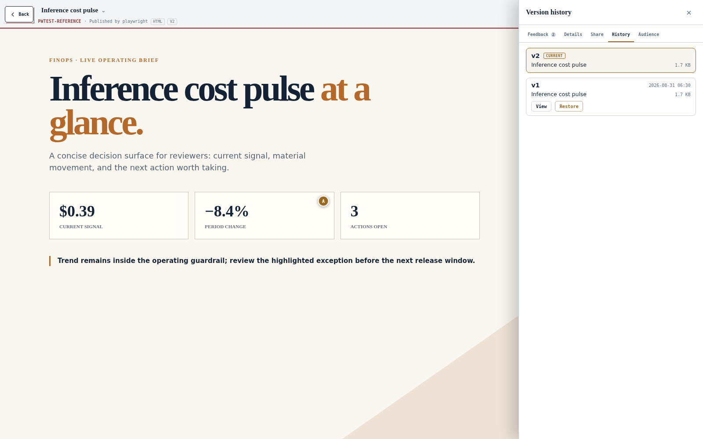
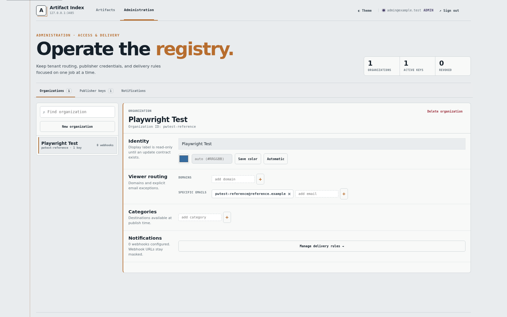
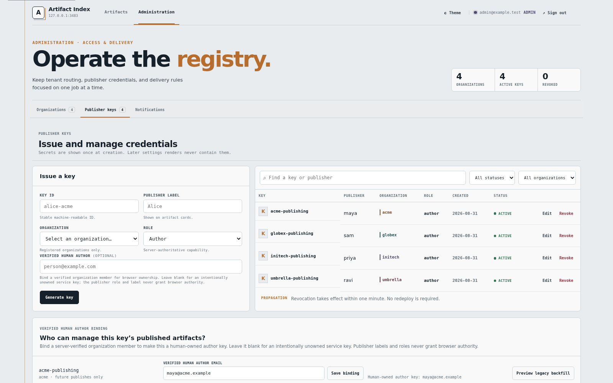

# artifact-mcp

> **The self-hosted, multi-tenant platform for your AI agents' HTML artifacts — your domain, your
> data, your rules.**

[](LICENSE)


Your agents already generate HTML — dashboards, reports, one-pagers, whole mini-sites.
**artifact-mcp is where that output lives.** An agent calls an MCP tool, gets back a real URL on
**your** domain, and the page is served from **your** infrastructure at `https://your-domain/<id>`.
Around every artifact you get an org-scoped gallery, version history, viewer feedback, view
analytics, public share links, and per-org notifications.

Not a hosted primitive that publishes to someone else's cloud — **a platform you run**, with real
multi-organization tenancy, for teams that want to own their work. The production runtime is one
native Rust/Axum container with SQLite + files on disk and no third-party lock-in. Preview
thumbnails add an optional browser sidecar; the Node implementation remains a behavioral parity
reference for release testing.

### Built for teams, not just a publish button

- **Own the domain and the data.** Artifacts live at `https://your-domain/<id>`, in your SQLite, on
  your disk — never a vendor's bucket. Point it at any domain you control; orgs and colors are
  configured at runtime, not in code.
- **Real multi-tenancy.** Many organizations, each isolated: per-org upload keys, viewers scoped to
  their org by verified SSO identity, per-org categories, colors, and Discord notifications.
- **A gallery, not a graveyard.** Everything published is browsable, searchable, versioned, and
  commentable — an index your team actually uses, not a pile of orphan links.
- **Agent-native _and_ human-native.** Agents publish over MCP; humans review, comment (pinned to
  the exact spot on the page), and share — behind Cloudflare Access SSO.
- **Role-aware by construction.** Administrators can operate across organizations. Members see one
  organization, and Hide/Show or Delete appears only on files attributed to that verified uploader.

### New in v1.7.1

- **A rebuilt artifact library.** The left filter rail is gone. Search, quick views, organization
  and category dropdowns, sorting, and the grid/list switch now share one toolbar above equal-height
  cards. The library restores filters and scroll position when a viewer returns from an artifact.
- **A focused review shell.** Opening an artifact removes the Gallery masthead and gives the
  sandboxed artifact the page. Back returns to the library; details, feedback, sharing, history,
  audience, reactions, and file actions live in compact menus and the inspector.
- **Anchor v2 feedback.** Point and region comments persist semantic evidence such as anchor kind,
  DOM path, node id, and quote alongside normalized coordinates. Copy prompt packages that context
  with the exact artifact revision for an agent, while stale-revision markers fail safely.
- **Safer self-service administration.** Verified upload owners can hide, show, or delete their own
  artifacts. Administrators can edit a publisher key's label, role, and verified owner without
  rotating the credential.

## Screenshots

*Screenshots are from an isolated Rust v1.7.1 release-candidate server at schema 32, seeded with 12
fictional artifacts across acme, globex, initech, and umbrella. The optional preview renderer is
enabled. Both light and dark themes ship; light is shown here.*

| Administrator gallery | Card actions |
|---|---|
| [](docs/screenshots/01-gallery-admin-grid.png) | [](docs/screenshots/02-gallery-admin-actions.png) |
| Search, quick views, organization and category dropdowns, sorting, and layout controls share one top toolbar. | Change category or organization in place; deletion remains explicit and confirmed. |

| List layout | Member gallery |
|---|---|
| [](docs/screenshots/03-gallery-admin-list.png) | [](docs/screenshots/04-gallery-member-grid.png) |
| A compact list keeps previews, metadata, and controls readable without changing the underlying collection. | Members get org-scoped counts and filters; ownership controls appear only on their verified uploads. |

| Anchored review | Version history |
|---|---|
| [](docs/screenshots/05-viewer-feedback.png) | [](docs/screenshots/06-viewer-history.png) |
| The artifact takes priority while the inspector handles threaded anchor-v2 feedback, point/region markers, and Copy prompt. | Browse current and retained revisions, open an older body, or restore it as a new revision. |

| Organization administration | Publisher credentials |
|---|---|
| [](docs/screenshots/07-admin-organizations.png) | [](docs/screenshots/08-admin-publisher-keys.png) |
| Search organizations and edit routing, color, categories, and delivery from one selected detail. | Issue/revoke scoped keys, assign a verified owner, and explicitly preview legacy-owner backfills. |

## Features

### Publish & content
- **Publish via MCP** — `publish_artifact` (single self-contained HTML) and `publish_bundle`
  (multi-file: several pages that link to each other + a shared stylesheet + assets).
- **Multi-file bundles** — files served under `/raw/:id/…` so relative links (`_shared.css`,
  cross-linked pages, images) resolve. Hosts whole interactive hubs as one artifact.
- **Replace in place** — `update_artifact` swaps content/metadata while keeping the **same id and
  URL**, so iterating a page never breaks existing links. Each update bumps a revision.
- **Version history + restore** — every update snapshots the outgoing revision; browse the
  history and restore any retained revision (`list_revisions` / `restore_artifact`). Restoring is
  itself a new revision (append-only, undoable). Retention capped by `MAX_HISTORY`.

### Multi-tenancy
- **Org registry** — admin-managed organizations, each with a name, **specific email members**,
  one or more **email domains** (which auto-tenant a signed-in viewer), and a **category** list —
  all edited in Settings.
- **Cloudflare Access front door** — humans log in (SSO); the app verifies the Access **JWT** so
  the tenant boundary can't be spoofed. `/mcp` is Access-bypassed (agents use the API key).
- **Public share links** — an org member or admin can make an unlisted, read-only link for one
  artifact. Links are protected by an unguessable token and can expire or be revoked; they are
  deliberately public to anyone who has the URL.
- **Strict isolation** — each key is locked to its org; each viewer is scoped by their verified
  email identity. Cross-org reads return 404; cross-org mutations for a known id return 403. Admins see every org.

### Organize
- **One role-scoped collection** — search titles, publishers, and categories; use organization and
  category dropdowns; switch grid/list layout; combine favorites, review, hidden, and sort states;
  keep compact result counts honest. Filters stay in the top toolbar, so cards use the full width.
- **Categories** — group an org's artifacts and edit an artifact's category from its More menu or
  the Viewer Details inspector.
- **Show / hide** — unlist an artifact (`set_visibility`): it drops from the member collection and
  prev/next nav, but its direct URL still opens for anyone with org access (unlisted, not a
  security boundary). Administrators may act on every authorized artifact; members receive the eye
  only for artifacts whose server-recorded owner matches their verified identity.
- **Move and delete safely** — administrators can re-tenant an artifact from its More menu; owner
  or administrator deletion requires an explicit confirmation and removes the artifact's related
  revisions, feedback, reactions, audience records, and active shares.

### Collaborate
- **Focused artifact review** — the full viewer omits the Gallery masthead, keeps the artifact in a
  sandboxed iframe, and moves secondary work into a trusted inspector. Back returns to the library
  with its filter and scroll snapshot intact.
- **Viewer feedback threads** — in-org viewers leave feedback from the trusted shell; each comment
  is its own thread with nested replies, so discussion about different items stays separate.
- **Delete / resolve** — a viewer can delete or resolve their own comments; admins any in-org; the
  publishing agent resolves/reopens via MCP. Resolve is reversible.
- **Anchored comments** — pin a comment to a **point** or drag a **region box** on the artifact.
  Anchor v2 stores semantic evidence with normalized coordinates, and markers track scroll and
  resize. Copy prompt includes the artifact id, exact revision, page, anchor evidence, and comment
  for an agent. Older-revision pins remain visible as stale feedback but do not repaint or deep-link.

### Insight
- **View analytics** — named, Access-verified views per artifact: total views, unique viewers, and
  who viewed (`artifact_stats`). Admin/self views excluded so counts mean real reach. Counts are
  visible to same-org viewers; the named viewer list only to admins and the owning agent.
- **Favorites & sentiment** — per-viewer favorite ♥ (floats to the top of their gallery) and
  👍/👎 votes; an admin per-org "Most viewed" rollup.

### Notify
- **Per-org Discord webhooks** — register one or more webhooks per org, each subscribed to any of
  six events (`published`, `updated`, `restored`, `deleted`, `feedback`, `resolved`). Route
  publishes to `#artifacts` and feedback to `#feedback`, etc. URLs are validated to the Discord
  host, masked in every UI/API response, and encrypted at rest with `WEBHOOK_ENC_KEY`. The
  documented no-key mode preserves zero-config with a loud plaintext-storage warning. Committed
  events enter a durable, bounded at-least-once queue: delivery never blocks the mutation, retries
  are bounded, and a process stop during an ambiguous provider attempt can produce a duplicate.
  Dead-letter rows and privacy-safe worker/queue metrics make failures actionable. See the
  [durable-delivery runbook](docs/ops/discord-durable-delivery.md). Test button.
- **Optional persistent thumbnails** — gallery cards use authenticated static images, never live
  preview iframes. A single-file `published`, `updated`, or `restored` event renders one PNG that is
  persisted by content digest and reused by Discord. This is off by default and uses a separate
  Playwright sidecar, so the core image has no browser dependency. Bundles use a static placeholder.
- **Optional Discord notification threads** — an organization can select one existing
  `published` artifact webhook, then use a narrowly scoped bot credential to start a public thread
  on that artifact's notification when its first mirrored comment arrives. The webhook authors
  the notification and comments; the bot manages the thread. Organization enablement is the
  outbound default, while artifacts may stay local or explicitly enable two-way human Discord
  replies. Discord identity never grants Artifact MCP access. See the
  [Discord runbook](docs/ops/discord-durable-delivery.md#organization-discord-threading).

### Operate
- **Settings (admin)** — manage orgs / domains / categories / webhooks, and generate, edit, or
  revoke per-org upload keys with a human display label, role, and optional verified owner. Keys
  stay hashed, secrets are shown once, and metadata edits do not rotate the credential. Task tabs
  separate Organizations, Publisher keys, and Notifications.
- **Crash-safe storage** — staging→rename lifecycle, commit-then-swap updates, and startup audit
  recovery reconcile the DB and files on disk after an interrupted operation.
- **MCP observability** — privacy-safe Prometheus metrics, opaque request correlation, bounded
  result-size signals, and deployable alert rules. See
  [`docs/ops/mcp-observability.md`](docs/ops/mcp-observability.md) and the repeatable
  [`connector-readiness checklist`](docs/ops/connector-readiness.md).
- **Discord delivery operations** — two bounded workers drain the durable queue; queue age,
  dead-letter, rate-limit, and worker-health metrics have deployable alerts. See the
  [durable-delivery runbook](docs/ops/discord-durable-delivery.md) before rotating a webhook or
  its encryption key.
- **Optional private MCP ingress** — an isolated, digest-pinned Compose profile for Anthropic's
  MCP Tunnels research preview, with file-backed secrets, independent health signals,
  Anthropic-side validation, and a one-command local rollback. See the
  [`Anthropic MCP Tunnel runbook`](docs/ops/anthropic-mcp-tunnel.md).
- **No database server** — SQLite (versioned migrations) + files on disk. One container.

## How it compares

There are good tools for *publishing a page* from an agent. artifact-mcp aims one level up — the
**team platform** around those pages: many orgs, a shared gallery, history, analytics, and review,
all on infrastructure you own.

| | **artifact-mcp** | Hosted publish-MCP<br>(e.g. Stacktree) | Deploy-a-page MCP<br>(e.g. EdgeOne Pages) | Self-hosted chat UIs<br>(LibreChat / Open WebUI) |
|---|:--:|:--:|:--:|:--:|
| Agent publishes HTML over MCP | ✅ | ✅ | ✅ | ❌ *(renders inline only)* |
| Runs on **your** infra + domain | ✅ | ⚠️ mostly hosted | ✅ | ✅ |
| **Multi-organization tenancy** | ✅ | ❌ | ❌ | ❌ |
| Org-scoped gallery + categories | ✅ | ❌ | ❌ | ⚠️ |
| Version history + restore | ✅ | ⚠️ implicit | ❌ | ❌ |
| Anchored viewer feedback | ✅ | ✅ | ❌ | ❌ |
| View analytics | ✅ | ❌ | ❌ | ❌ |
| Public share links (expiry + revoke) | ✅ | ✅ | ❌ | ❌ |
| Per-org notifications | ✅ | ❌ | ❌ | ❌ |
| Open source | ✅ | ❌ | ✅ | ✅ |

If you just want one unguessable link to one page, a hosted primitive is simpler. If you want **a
place your whole team's agent output lives — owned, tenanted, versioned, and reviewable** — that's
this.

<sub>Comparison based on each project's publicly documented features as of July 2026; verify against
their current docs.</sub>

## MCP protocol and tools (`POST /mcp`, bearer key or OAuth token)

Artifact MCP serves the existing stateful `2025-06-18` contract and the stateless `2026-07-28`
contract side by side. Modern clients can use `server/discover`, private-cache-aware artifact
resources (`resources/list`, `resources/read`, and `resources/templates/list`), typed/validated tool outputs,
negotiated MCP Apps, and durable preview tasks. Clients that do not advertise those capabilities
retain the ordinary text/structured fallback.

| Tool | Purpose |
|---|---|
| `publish_artifact(html, title, description, category, org)` | Publish one self-contained HTML page |
| `publish_bundle(files, entry, title, description, category, org)` | Publish a multi-file artifact; `files` is `{ "path": "content" }` |
| `list_artifacts()` | List what this key has published (with URLs) |
| `read_artifact(id, path?, revision?, offset?, limit?)` | Read one artifact, retained revision, or bundle file with bounded UTF-8 paging |
| `update_artifact(id, html\|files, entry, title, description, category)` | Replace content/metadata in place; bumps its revision (owner or admin) |
| `patch_artifact(id, expected_revision, edits, path?)` | Apply an atomic, revision-guarded batch of UTF-8-safe partial edits |
| `set_visibility(id, hidden)` | Unlist / relist an artifact (owner or admin) |
| `list_categories(org?)` | List your org's categories (admin may pass an org) |
| `set_category(id, category)` | Move an artifact to a category — no revision bump; auto-registers it (owner or admin) |
| `create_category(name, org?)` / `delete_category(name, org?)` | Manage your org's category list (admin may pass an org) |
| `delete_artifact(id)` | Delete an artifact (owner or admin) |
| `list_revisions(id)` | List an artifact's retained version history (owner or admin) |
| `restore_artifact(id, revision)` | Restore a past revision as a new revision (owner or admin) |
| `create_share(id, expires)` | Create an unlisted public share link (owner or admin) |
| `list_shares(id)` | List active public share links (owner or admin) |
| `revoke_share(token)` | Revoke an active public share link (owner or admin) |
| `artifact_stats(id)` | Views, unique viewers, and the named viewer list (owner or admin) |
| `list_feedback(id?)` | List viewer feedback + anchors + thread structure (owner or admin; admin sees all) |
| `resolve_feedback(feedback_id)` | Mark viewer feedback resolved (owner or admin) |
| `reopen_feedback(feedback_id)` | Reopen a resolved comment (owner or admin) |
| `regenerate_artifact_preview(id)` | Regenerate a current single-file thumbnail (owner or admin; MCP 2026 clients with Tasks support receive a durable task) |

All MCP tools use `Authorization: Bearer <API key>`. Org keys are locked to their own org; an
**admin** key may target any org with the `org` argument and can see all feedback. Tools that
mutate an artifact or read another owner's data require the artifact owner or an admin.

> MCP clients cache `tools/list` at connect — after a server update, reconnect the integration to
> pick up new tools/fields.

Modern clients that advertise `io.modelcontextprotocol/tasks` may receive a durable task from
`regenerate_artifact_preview`; poll it with `tasks/get`, acknowledge input updates with
`tasks/update`, or request cooperative cancellation with `tasks/cancel`. Task state is persisted
under the data volume and resumed after restart. Clients without Tasks support receive the same
operation as a bounded synchronous tool result. No other artifact operation is task-augmented.

The legacy catalog contains 21 tools. MCP 2026 adds `regenerate_artifact_preview` for 22; an
MCP-App-capable client additionally receives the app-only `submit_feedback` action.

### MCP surface synchronization

`node scripts/check-mcp-surface.mjs` is a release gate derived from the frozen tool definitions,
typed output schemas, Rust dispatch and OAuth scope mapping, README, conformance cases, and native
test registration. It reports the current names, protocol versions, required test coverage, and
fails when those surfaces disagree. It deliberately is not another tool registry.

When an intentional compatibility change spans a branch, run
`node scripts/check-mcp-surface.mjs --base origin/master` to include affected MCP paths in the
machine-readable report. Update the existing definition/schema/dispatch/docs/tests together; do
not add a handwritten manifest. Then run the reported conformance and Rust test commands.

## Architecture

```
Agent ──(MCP, API key)──▶ /mcp ──┐
                                 ├─▶ artifact-mcp (Rust · Axum + Askama) ─▶ SQLite + files on disk
Human ──(Cloudflare Access)──▶ gallery / /:id / /raw/:id/… ──┘   served at https://domain/<id>
Public ──(share token)────────▶ /s/:token[/…] ──────────────────┘
```

The production image is a stripped static Rust binary in a non-root distroless container. The Node
runtime is retained as an independent compatibility twin and test oracle; it is not the default
Compose service.

Two access surfaces, deliberately split:
- **Upload** (`/mcp`) — API-key auth, Access-bypassed (agents can't do interactive SSO).
- **View** (`/`, `/:id`, `/raw/:id/…`, `/settings`) — behind Cloudflare Access; the app verifies
  the Access JWT and scopes content to the viewer's org.
- **Share** (`/s/:token[/…]`) — only this path is public, and only when its unguessable token is
  active. It serves the live artifact in a sandbox with `X-Robots-Tag: noindex`; no viewer shell,
  feedback bridge, analytics, or mutation routes are exposed.

### Routes
| Route | Role |
|---|---|
| `POST /mcp` | MCP JSON-RPC, API-key or configured OAuth bearer authentication |
| `GET /metrics` | Prometheus MCP request, outcome, latency, cancellation, and bounded result-size metrics |
| `GET /` | org-scoped gallery (admin: all orgs, incl. empty ones as drop targets) |
| `GET /:id` | viewer shell (chrome + sandboxed iframe) |
| `GET /thumbnails/:id?v=<body_sha256>` | authenticated current-revision thumbnail or no-store placeholder |
| `GET /raw/:id` · `GET /raw/:id/*` | raw single-file / bundle serving (path-traversal guarded); `?anchor=1` injects the comment bridge, `?download` forces attachment |
| `GET /raw/:id/rev/:n[/*]` | serve a past revision's body |
| `GET /s/:token` · `GET /s/:token/*` | public read-only share delivery for a valid active token |
| `GET /:id/history` · `POST /:id/restore` | version history + restore |
| `POST /:id/react` | favorite / vote (per viewer) |
| `POST /:id/feedback` · `DELETE /:id/feedback/:fid` · `POST /:id/feedback/:fid/resolve` | threaded viewer feedback (own-or-admin manage) |
| `POST /:id/category` | set category (same-org member or admin) |
| `POST /:id/share` · `GET /:id/shares` · `DELETE /:id/shares/:token` | create, list, or revoke public share links (same-org member or admin) |
| `POST /:id/visibility` | hide / show (verified uploader-owner or admin) |
| `POST /:id/move` | category or org move — **admin** (org move re-tenants) |
| `DELETE /:id` | delete (verified uploader-owner or admin) |
| `GET /settings` + `/settings/keys*` + `/settings/orgs*` (owners, specific emails, domains, categories, webhooks) | admin management (all admin-only) |

### Key files
`src/main.rs` + `src/app.rs` (composition) · `src/http/routes/` (HTTP surface) ·
`src/security/` (Access, API-key, OAuth, and tenant policy) · `src/mcp/` (protocol negotiation,
tools, resources, Apps, and Tasks) · `src/artifacts/` (lifecycle, history, reads, and recovery) ·
`src/persistence/` (SQLite repositories and migrations) · `src/render/` + `templates/` + `assets/`
(Gallery, Viewer, and Administration) · `src/integrations/` (notifications and previews) ·
`src/observability.rs` (privacy-safe metrics).

The matching `server.js` and `lib/` modules form the Node compatibility twin exercised by
conformance and browser parity tests.

For domain language, invariants, module seams, and workflows, see [`CONTEXT.md`](CONTEXT.md).

## Configuration (`.env`)

| Var | Purpose |
|---|---|
| `ARTIFACT_API_KEYS` | Bootstrap keys, `clientId:org:secret` comma-separated (DB is authoritative after first boot) |
| `MCP_OAUTH_ISSUER` + `MCP_OAUTH_AUDIENCE` + `MCP_OAUTH_JWKS_URL` | Optional OAuth client-credentials resource-server mode; all three are required together |
| `MCP_OAUTH_ALLOWED_ALGS` | Asymmetric JWT algorithm allowlist; defaults to `RS256` |
| `MCP_OAUTH_MAX_TOKEN_LIFETIME_S` / `MCP_OAUTH_CLOCK_TOLERANCE_S` | Access-token maximum lifetime (default `3600`) and clock tolerance (default `30`) |
| `MCP_API_KEYS_ENABLED` | API-key compatibility switch; defaults to `1`, and may be `0` only with complete OAuth configuration |
| `WEBHOOK_ENC_KEY` | 32-byte base64 AES-256-GCM integration-secret key. Discord webhook URLs retain their legacy plaintext fallback when unset, but organization bot credentials cannot be saved without it |
| `DISCORD_BOT_TOKEN` | Migration fallback only for an organization with an existing PBI-079 discussion connection; save a write-only organization credential in Settings to retire it |
| `DISCORD_INBOUND_ENABLED` | Operator kill switch for explicitly authorized two-way Discord Gateway consumption; defaults to `0` and does not affect local feedback or outbound delivery |
| `AUDIT_LEDGER_HMAC_KEY` | Required 32-byte base64 HMAC key for the tamper-evident security audit ledger; startup fails closed when absent |
| `PREVIEW_RENDERER_URL` | Optional internal renderer base URL; unset keeps gallery placeholders and Discord text-only |
| `PREVIEW_RENDER_TIMEOUT_MS` / `PREVIEW_VIEWPORT` | Optional renderer timeout (default `8000`) and social-card crop (default `1200x630`) |
| `PREVIEW_MAX_PNG_BYTES` | Maximum accepted renderer response and persisted PNG size (default `7500000`) |
| `PUBLIC_BASE_URL` | Public deployment URL used for generated links; defaults to `http://localhost:3480` |
| `APP_NAME` / `APP_BRAND` | Portal display name and compact brand mark; defaults to `Artifact Index` / `A` |
| `ORG_EMAIL_DOMAINS` | Optional `domain:org` seeds — the registry (managed in Settings) is authoritative; default: the email domain **is** the org |
| `ADMIN_EMAILS` / `ADMIN_EMAIL_DOMAINS` | Who sees every org |
| `CF_ACCESS_TEAM_DOMAIN` + `CF_ACCESS_AUD` | Enable Access JWT verification (production) |
| `TRUST_ACCESS_HEADERS` | Set to `1` only for loopback local development; trusts an unverified, spoofable identity header |
| `REQUIRE_ACCESS_JWT` | Set to `1` to refuse startup unless both Access JWT variables are configured |
| `ACCESS_CLOCK_TOLERANCE_S` | Leeway in seconds (default `60`) for Access JWT `nbf`/`exp` checks, absorbing edge/origin clock skew so a just-issued token isn't briefly rejected. Keep the host NTP-synced too |
| `HOST_BIND` | Host publish address; defaults to loopback-only `127.0.0.1` |
| `MAX_ARTIFACT_BYTES` (2MB) · `MAX_BUNDLE_BYTES` (8MB) · `MAX_BUNDLE_FILES` (100) | Content caps |
| `MAX_HISTORY` (20) | Retained revisions per artifact |
| `FEEDBACK_MAX_BODY` (4000) | Max feedback length |
| `MCP_JSON_LIMIT` | Optional JSON-envelope override; defaults above the configured bundle cap |
| `INGRESS_*` | Origin admission limits for HTTP headers/URI/body reads, JSON complexity, connection/request/mutation concurrency, render queue depth, and token-bucket read/mutation/MCP/upload/feedback/admin/share source budgets; verified MCP publishers and Access viewers receive separate post-resolution budgets. Conservative defaults are shown in `.env.example`. |
| `TRUSTED_PROXY_CIDRS` | Optional comma-separated Cloudflare/proxy CIDRs. Only these peers may supply `CF-Connecting-IP`; `X-Forwarded-For` is ignored |

See `.env.example`.

OAuth service tokens must carry `sub` or `client_id`, `org`, integer `iat`/`exp`, and an explicit
`scope` string (or `scp` string/array). ArtifactShelf recognizes `artifacts:read`,
`artifacts:publish`, `artifacts:review`, `artifacts:visibility`, and `artifacts:delete`.
Configured deployments publish RFC 9728 metadata at
`/.well-known/oauth-protected-resource`; insufficient token scope returns HTTP 403 with a
`WWW-Authenticate` challenge naming the required scope.

Generate `WEBHOOK_ENC_KEY` once with `openssl rand -base64 32`, store it outside the repository,
and retain it with encrypted backups. Existing plaintext webhook rows are encrypted in place on
the first startup with a key; encrypted and plaintext rows can coexist during rollout.

### Rotating the webhook encryption key

Encrypted rows cannot be opened with a replacement key, so do not simply overwrite
`WEBHOOK_ENC_KEY`. The supported manual rotation is:

1. While the old key is active, inventory each webhook's events/label and copy its full URL from
   Discord's integration settings (artifact-mcp deliberately shows only a mask).
2. Temporarily remove every event subscription from those registrations so no new delivery rows
   target them. Keep the registrations and old key in place while the durable-delivery queue
   drains; follow the
   [runbook](docs/ops/discord-durable-delivery.md#replacing-a-discord-webhook-safely) and do not
   continue while any old-target row is non-terminal.
3. Delete the drained registrations in Settings, stop the app, and back up the data volume plus the
   old key.
4. Generate and install the new key, restart, recreate the webhooks, use the awaited Test action,
   and restore their subscriptions. New rows are encrypted with the new key. Keep the old key as
   long as any backup containing old encrypted rows is retained.

This procedure has a notification outage but neither strands queued work nor writes decrypted URLs
back to SQLite. A no-outage, dual-key rotation requires a future encryption-lifecycle migration.

### Optional: persistent gallery and Discord thumbnails

Add this to `.env`:

```dotenv
PREVIEW_RENDERER_URL=http://artifact-preview:3000
```

Then start and smoke-test the profile:

```bash
docker compose --profile preview up -d --build
docker compose exec artifact-preview npm run smoke
```

The sidecar renders attacker-controlled HTML. Its isolation boundary is the **container itself**:
a non-root user, read-only root filesystem, dropped Linux capabilities, `no-new-privileges`, a
seccomp profile, an internal-only network, resource limits, and browser request blocking. Chromium's
own in-process sandbox is disabled (`chromiumSandbox: false`) because it requires `CAP_SYS_CHROOT`/user
namespaces that this hardened container deliberately removes; the container confinement above is the
compensating control. Keep all of it intact. Do not publish its port,
attach it to the tunnel, mount host/app data, or give it secrets. If it is absent, slow, or errors,
notifications automatically fall back to the existing text embed and gallery cards use a stable
first-party placeholder without blocking publication. Valid PNGs live under
`DATA_DIR/previews/<artifact-id>/<body_sha256>.png`; include this directory in normal data-volume
capacity planning and backups. Startup removes orphan/partial previews and serially backfills
existing single-file artifacts at low priority. Updates retire older digest files after the new PNG
is installed. Bundles remain placeholder-only in v1. Removing the sidecar prevents new renders but
does not break the gallery or remove already-persisted current thumbnails.

## Quick start

New here? [`GETTING_STARTED.md`](GETTING_STARTED.md) is a phase-by-phase setup — local run first,
then the full Cloudflare Tunnel + Access production deploy — with a verification check after each
step (and written so an AI agent can drive it).

```bash
cp .env.example .env      # set ARTIFACT_API_KEYS; add prod CF_ACCESS_* after Access bootstrap
docker compose up -d --build  # builds and runs the native Rust image
```

Publish (raw MCP call):
```bash
curl -H "Authorization: Bearer $KEY" -H 'content-type: application/json' \
  -d '{"jsonrpc":"2.0","id":1,"method":"tools/call","params":{"name":"publish_artifact",
       "arguments":{"html":"<h1>hi</h1>","title":"Demo","description":"first artifact"}}}' \
  https://your-domain/mcp
```

## Cloudflare setup (production)

Bootstrap the Access app before strict runtime startup: Cloudflare does not assign its AUD until
the app exists, while artifact-mcp reads that AUD during module initialization.

1. Configure the Tunnel/public hostname and private origin path.
2. Export the setup-only `CF_API_TOKEN`, `CF_ACCOUNT_ID`, `PUBLIC_BASE_URL`, and
   `CF_ACCESS_IDP_ID`; preview with `node scripts/cf-access-setup.mjs`, then run it with `--apply`.
3. Create or verify the operator-owned policies: `/mcp` **Bypass → Everyone**, `/s/*`
   **Bypass → Everyone**, and catch-all **Allow** for intended viewers. The script never changes
   policies.
4. Put the emitted `CF_ACCESS_AUD` and `CF_ACCESS_TEAM_DOMAIN` in the runtime environment with
   `REQUIRE_ACCESS_JWT=1`, then fully restart artifact-mcp.

Optional `CF_ACCESS_LOGIN_*` values update the account-wide reusable Access Custom Page for every
Access application; they do not configure a per-app `logo_url`. See
[`docs/DEPLOY-CLOUDFLARE.md`](docs/DEPLOY-CLOUDFLARE.md) for inputs, least-privilege permissions,
the exact bootstrap sequence, policy requirements, and troubleshooting.

### Network exposure

Cloudflare Access guards the tunnel hostname, not an origin port reached directly. Do not publish
the origin on the LAN. The shipped Compose file defaults to the loopback-only
`127.0.0.1:3480:3480` mapping (controlled explicitly with `HOST_BIND`). A host-level public
Cloudflare Tunnel can safely target that loopback port. A same-network, operator-owned public
tunnel overlay may instead target `http://artifact-mcp:3480` and remove the host publish entirely.

The opt-in `anthropic-tunnel` profile is different: it is Anthropic's research-preview private MCP
transport, not the public ingress for the gallery. It leaves the default path untouched until an
operator validates from Anthropic's side and deliberately changes the external `/mcp` edge policy.
See [`docs/ops/anthropic-mcp-tunnel.md`](docs/ops/anthropic-mcp-tunnel.md).

Onboard a viewer org: create it in **Settings**, then add an email domain or a specific address.
Viewer tenant resolution is: configured admin identity → explicit email mapping → registered
domain → `ORG_EMAIL_DOMAINS` → the email domain itself. For example, mapping
`contractor@gmail.com` to `acme` routes only that address to Acme; it does not map all of
`gmail.com`.

An explicit email mapping does **not** modify Cloudflare Access policy, send an invitation, or
authenticate the user. The operator must separately permit that address in the Cloudflare Access
Allow policy; the mapping only assigns an already authenticated viewer to an artifact-mcp org.
Let an org **publish**: generate a key for it in Settings.

## Security model

- Cloudflare strips client-supplied `Cf-Access-*` headers at the edge; the app additionally
  **verifies the Access JWT**, so viewer identity (and org) can't be spoofed.
- Viewer identity fails closed by default: without both `CF_ACCESS_*` JWT settings, no header can
  authenticate a viewer. `TRUST_ACCESS_HEADERS=1` restores unverified header trust only as an
  explicit loopback-development convenience and is unsafe on a reachable origin. Production must
  configure both JWT settings and can enforce them at startup with `REQUIRE_ACCESS_JWT=1`.
- **Resilient sign-in, same trust bar** — identity resolves from the verified `Cf-Access-Jwt-Assertion`
  header or, when it lags in the moment right after login, the equally-verified `CF_Authorization`
  session cookie; JWT checks tolerate small edge/origin clock skew (`ACCESS_CLOCK_TOLERANCE_S`); and a
  cold direct-link navigation during the Access propagation window gets a single auto-reload instead of
  a dead-end 404. None of this widens the tenant boundary — every path still verifies the JWT (same
  JWKS, issuer, and audience) and applies the normal org concealment.
- Every artifact is attributed to its uploading key and snapshots that key's optional
  server-verified human owner. Revoke a key to cut off a collaborator instantly. The owner snapshot
  gates member Hide/Show and Delete without trusting publisher labels or caller-supplied identity.
  Org move re-tenants an artifact and all its child rows atomically.
- **Sandboxed rendering** — every raw and shared response carries a CSP sandbox without `allow-same-origin`
  (including `.svg`/`.xml` and downloads), so uploaded content runs in a null origin.
- **Anchored-comment bridge** — the comment/position script is injected **only** into the
  `?anchor=1` representation (raw + downloads are byte-for-byte unchanged), is a fixed server
  constant, and the shell parent **never reads the iframe DOM**: all anchor data arrives via
  `postMessage`, validated by frame identity and a type allowlist, and treated as untrusted.
- **Webhooks** — URLs are validated to the Discord webhook host (no SSRF to arbitrary hosts),
  masked in all responses, and encrypted at rest with AES-256-GCM when `WEBHOOK_ENC_KEY` is set.
  Without it, the service remains zero-config and stores URLs in plaintext after a prominent
  one-time startup warning. URLs are decrypted only by bounded durable delivery or the awaited
  administrator test; provider delivery is at-least-once rather than exactly-once, with explicit
  duplicate-risk and dead-letter state for operators.
- **Discord bot credentials** — Settings accepts a write-only token per organization, validates
  the bot and exact selected destination, and encrypts it with `WEBHOOK_ENC_KEY`. Token material is
  never returned, masked with token fragments, logged, audited, queued, or sent to an incoming
  webhook URL. `DISCORD_BOT_TOKEN` is process-only migration fallback for an organization with an
  existing pilot connection; unrelated organizations cannot implicitly consume it. Outbound
  threading needs View Channel, Create Public Threads, and Send Messages in Threads. Exact
  historical recovery additionally needs Read Message History. Explicit per-artifact two-way
  mode also requires `GUILDS`, `GUILD_MESSAGES`, privileged `MESSAGE_CONTENT`, View Channel, and
  Read Message History. Outbound policy alone never starts Gateway consumption.
- **Preview renderer** — optional and off by default. It receives HTML bodies rather than gated
  artifact URLs, runs without host/data/secret mounts on an internal network with no egress, blocks
  browser network requests/navigation, uses an ephemeral Chromium context, and has hard time and
  memory limits. The renderer has no public or tunnel exposure.
- **View privacy** — named viewer lists reach only admins and the owning agent; never cross-tenant.
- **Public shares** — a share is unlisted public, not private: anyone with its URL can view the
  live artifact. A random URL-safe token, server-side expiry, and immediate revoke are its access
  controls; invalid, expired, and revoked tokens all return the same 404.
- Bundle paths are sanitized (no `..`, no absolute); size/file caps enforced; the Docker build
  context excludes deployment secrets, persistent data, and local planning files.
- Not included: content scanning or a physically separate raw-content origin. Origin-side ingress
  rate limits and concurrency bounds complement Cloudflare/proxy controls; they intentionally use
  opaque source/principal fingerprints and never distinguish valid from invalid keys or shares.

## Roadmap

- Admin sentiment dashboard (votes + views already collected)
- Full-text search across the library
- Cooperative (`data-anchor`) precise anchoring; text-range highlights
- Per-key quota policy recalibration for a larger declared envelope; artifact TTL/expiry; deleted-artifact tombstone
- Optional separate artifact-delivery origin and content scanning

External no-login sharing is intentionally limited to explicit per-artifact links under `/s/*`;
the gallery and all ordinary artifact routes remain Access-gated.

## License

Apache License 2.0 — see [`LICENSE`](LICENSE) and [`NOTICE`](NOTICE). Contributions are accepted
under the same license; see [`CONTRIBUTING.md`](CONTRIBUTING.md).
