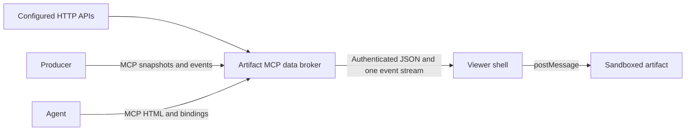

# Live data and PR Watch

Publish HTML once, then deliver current JSON data without rewriting the artifact. An artifact can
combine several APIs through named bindings. The authenticated viewer shell owns one event stream
and passes data into its sandboxed iframe. Artifact code keeps its opaque origin and has no network
access. See [ADR-0009](adr/0009-live-data-via-named-sources-and-shell-broker.md) and
[issue #58](https://github.com/AgentShelf-OSS/artifact-mcp/issues/58).



## Configure sources

Set `ARTIFACT_DATA_SOURCES_FILE` to a JSON file readable by the server. Copy the
[PR Watch source example](../ops/data-sources.pr-watch.example.json), set its `org` to the exact
organization that will own the artifact, and confirm the server can reach its `base_url`. For a
Docker installation with the existing `/data` volume, place the operator file in that volume and
set `ARTIFACT_DATA_SOURCES_FILE=/data/data-sources.json`. The server reads it at startup.

A data source belongs to one organization and defines named operations and subscriptions. HTTP
operations use GET requests with configured paths. Parameters are explicitly declared, validated,
and either inserted into a path placeholder or sent as query parameters. The browser cannot choose
a URL or pass arbitrary headers. Redirects are refused.

```json
{
  "sources": [{
    "id": "metrics-api",
    "org": "agentshelf",
    "kind": "http",
    "base_url": "https://api.example.com",
    "headers_env": { "Authorization": "METRICS_API_AUTHORIZATION" },
    "operations": {
      "summary": {
        "path": "/metrics",
        "params": { "days": { "type": "integer", "minimum": 1, "maximum": 90 } }
      }
    },
    "subscriptions": {
      "summary": { "transport": "poll", "operation": "summary", "interval_ms": 30000 }
    }
  }]
}
```

`headers_env` maps header names to environment variable names. Supply the complete header value,
such as a bearer authorization value, through the deployment's secret manager. Discovery and
viewer messages never expose those values or the source URL. Unset referenced variables fail
configuration validation.

Subscriptions support `sse`, `poll`, and `push`. SSE sources specify a path and the event names to
forward. Poll subscriptions periodically invoke an operation without required parameters. Each
subscription has an independent connection status and replay position. A failed upstream retries
without disconnecting other bindings.

## Discover and bind through MCP

`list_data_sources` returns the caller's available sources, their public parameter definitions,
and subscription transports. An administrator may specify `org`. `get_data_bindings` reads an
artifact's manifest. `set_data_bindings` replaces that manifest after checking publisher write
permissions and source organization.

```json
{
  "id": "ARTIFACT_ID",
  "bindings": {
    "reviews": {
      "source": "pr-watch",
      "operations": ["status", "runs", "run_detail", "run_routes", "route_detail", "daily", "analytics"],
      "subscriptions": ["events"]
    },
    "metrics": {
      "source": "metrics-api",
      "operations": ["summary"],
      "subscriptions": ["summary"]
    }
  }
}
```

Administrators can manage persisted sources and artifact bindings in
[the Connections workspace](#manage-connections-in-administration). Operator-file sources
remain available as read-only entries.

Operators and administrators configure sources; a publisher chooses only among those sources.
At most eight bindings and sixteen concurrent subscriptions belong to an artifact connection.
Changing a binding's definition clears its producer data. Unchanged bindings retain their data.

## Use the artifact client

The current authenticated viewer injects `window.artifact.data` before artifact scripts. Wait for
its readiness result before showing connected content. Raw documents, public shares, retained
revisions, and exported files opened outside the viewer have no live-data capability; show a
disconnected state when the client is unavailable or reports `enabled: false`.

```js
const client = window.artifact?.data;
const connection = client ? await client.ready : { enabled: false };
if (!connection.enabled) {
  showDisconnected();
} else {
  const status = await client.query("reviews", "status");
  renderStatus(status);
  const stop = client.subscribe("reviews", "events", event => {
    if (event.event === "data:status") renderConnection(event.data.state);
    else if (event.event === "data:resync") reloadStatus();
    else renderEvent(event.data);
  });
  window.addEventListener("pagehide", stop, { once: true });
}
```

`query(binding, operation, params, { signal })` returns the upstream JSON value and supports
cancellation with an AbortSignal. `subscribe(binding, subscription, callback)` returns an
unsubscribe function. Event envelopes contain `binding`, `subscription`, `event`, `id`, and `data`.
The broker preserves selected upstream event names and IDs. Combined replay cursors contain an
independent ID for each subscription. A replay gap tells the client to reload authoritative data.

The viewer uses `GET /:id/data` to read bindings, `POST /:id/data/query` for queries, and
`GET /:id/data/events` for a multiplexed SSE stream. Viewer authentication, organization checks,
and the existing request-authenticity policy protect these routes.

## Receive producer writes through MCP

Configure a source with `kind: "push"`, operations that expose snapshot keys, and push subscriptions:

```json
{
  "id": "deployments",
  "org": "agentshelf",
  "kind": "push",
  "operations": { "status": { "key": "status" } },
  "subscriptions": { "events": { "transport": "push" } }
}
```

Bind it to an artifact, then have the producer call `set_artifact_data` with
`{ id, binding, key, value }` to update a snapshot. Call `append_artifact_events` with
`{ id, binding, subscription, events: [{ id, event, data }] }` to append a batch. Producer calls use
publisher bearer authentication and artifact write permissions. No model invocation is needed.

Snapshot writes return a revision. Event writes return accepted and duplicate counts. Reusing an
event ID is idempotent within that artifact, binding, and subscription while the event is retained.
Snapshots and events persist independently from HTML, so writes never create HTML revisions.

## Export and publish PR Watch

The [PR Watch source configuration](../ops/data-sources.pr-watch.example.json) exposes status,
history, run and route details, daily aggregates, analytics, and events. Its
[binding manifest](../ops/data-bindings.pr-watch.example.json) uses the binding name `reviews`.
History and analytics operations allow thirty seconds because the LAN API can take more than ten
seconds to answer. Status keeps the default ten-second timeout.
The dashboard export comes from the maintained Bun implementation in the adjacent
`pr-review-daemon` repository, preserving the standalone dashboard's design and behavior.

Export the dashboard from that repository:

```sh
bun scripts/export-dashboard-artifact.ts --output /tmp/pr-watch.html
```

Then publish the resulting HTML and binding manifest from Artifact MCP:

```sh
node scripts/publish-data-artifact.mjs \
  --mcp https://YOUR_ARTIFACT_HOST/mcp \
  --html /path/to/pr-watch.html \
  --bindings ops/data-bindings.pr-watch.example.json \
  --title 'PR Watch'
```

Supply `ARTIFACT_MCP_API_KEY` through your secret manager. An admin key can use `--org` to select
the artifact organization. Add `--artifact-id` to update an existing dashboard at the same URL.
The publisher script checks source discovery before publishing HTML, then applies its bindings.
If binding assignment fails, the error identifies the artifact so the operation can be retried.

PR Watch's regular JSON requests and its live event tail use the bridge in exported mode. The
standalone dashboard continues to use its own API. Artifact viewers never enter a dashboard token
or contact the LAN API directly. The current LAN deployment is reachable without login; a
dashboard deployment requiring cookie-based login needs a server-side authentication adapter.

## Limits and operations

- With no registered sources, existing artifacts continue working with live data disabled.
- Source registration is limited to 32 sources with 16 operations and subscriptions per source.
- Query responses and SSE frames are bounded to one MiB. HTTP operations default to a ten-second
  timeout and can specify `max_bytes` and `timeout_ms` within the supported bounds.
- Poll intervals are between one second and one minute.
- The Rust server admits at most 64 live viewer streams. Slow viewers use bounded buffers;
  upstream connections close when the viewer disconnects.
- Producer snapshots are at most 256 KiB each. Event batches contain at most 100 events and one MiB
  of data. Each push subscription retains at most 1,000 events.
- HTML history does not preserve the current state of a remote API. Historical representations
  remain disconnected.
- The configured server must reach its upstream APIs. Deployment of the upgraded server and
  operator configuration is an owner-run operation; publication follows deployment.

## Manage connections in administration

Open `/settings/connections`, or select **Connections** in Settings. Only administrators
can read this workspace and its APIs. Select an organization or search for a connection.
Each entry shows its origin, transports, health, and number of connected artifacts.

Select **New connection** to create a managed HTTP API or producer channel. Add named
operations and subscriptions. HTTP operations specify a GET path, bounded parameters,
a timeout, and a response size limit. HTTP subscriptions use an SSE path or poll a named
operation. Producer channels use snapshot keys and push subscriptions. Save the connection
before granting its operations to an artifact.

Credential references map a header name to an environment variable name, for example
`Authorization` → `METRICS_AUTHORIZATION`. Supply the value in protected deployment
configuration. The workspace never accepts or returns the value. A saved connection with
missing references reports `config_error` and cannot make requests until those variables
are available. File-defined operator connections remain read-only. Their startup validation
remains strict.

**Test connection** performs one bounded GET for a selected HTTP operation, or checks a
producer channel's configuration. The result shows timing and response metadata. It does
not show upstream payloads or headers. Health records activity observed since this server
process started. No timestamp means no activity has been observed.

`idle` means no activity has been observed. `connected` means a check, query, or event
succeeded. `unavailable` and `reconnecting` identify failed requests or streams awaiting
another attempt. `disabled` suspends data access, while `config_error` identifies missing
credential references. Use the last query and event timestamps to assess data freshness;
a connected state alone does not guarantee recent events. Retry counts reset after success.

After an upstream failure, subscriptions retry with increasing delays up to thirty seconds.
Other sources keep running. Correct the endpoint or restore upstream service, then use
**Refresh health** to inspect the next success. A **Test connection** check can verify a
named HTTP operation. Supply missing environment variables through deployment configuration
and restart the server to load their values.

The **Connected artifacts** section links to affected artifacts and opens their binding
editor. Removing or changing a binding clears that binding's producer data. Unchanged
bindings keep their data. A connection cannot be deleted while a current artifact binds
it. Its organization and capabilities also cannot be removed while bindings use them.
Disable a connection to retain its configuration and bindings while suspending its data
access. Re-enable it to resume the affected subscriptions.

Managed changes take effect without an application restart. Only subscriptions for the
changed source reconnect and resynchronize. Other sources continue. Concurrent edits use
a version check: reload the connection if another administrator has changed it. Source
changes and their privacy-safe audit records commit in the same database transaction.

### Administration API

These routes require verified administrator identity. Every unsafe request also needs the
existing same-origin mutation signal (`X-Artifact-Mutation: 1`). Responses use no-store.
The frontend uses the same source and binding validation as MCP.

| Route | Purpose |
| --- | --- |
| `GET /settings/data-sources?org=acme` | List connection views and organization names |
| `GET /settings/data-sources/:id` | Inspect configuration, health and version |
| `POST /settings/data-sources` | Create `{definition, enabled}` |
| `PATCH /settings/data-sources/:id` | Replace `{definition, enabled, expected_version}` |
| `POST /settings/data-sources/:id/enable` or `/disable` | Change state with `{expected_version}` |
| `POST /settings/data-sources/:id/test` | Check `{operation, params}` for HTTP; `{}` for push |
| `GET /settings/data-sources/:id/impact` | List current affected artifacts and deletion eligibility |
| `DELETE /settings/data-sources/:id` | Delete an unused connection with `{expected_version}` |
| `GET /settings/data-bindings/:artifactId` | Read current artifact binding grants |
| `PUT /settings/data-bindings/:artifactId` | Replace `{bindings}` and reconcile changed bindings |

Managed definitions are durable SQLite records. Source IDs are immutable and must be unique
across both origins. A startup collision fails with a corrective error; it never silently
overrides a source. Back up the database and the operator source file together.
