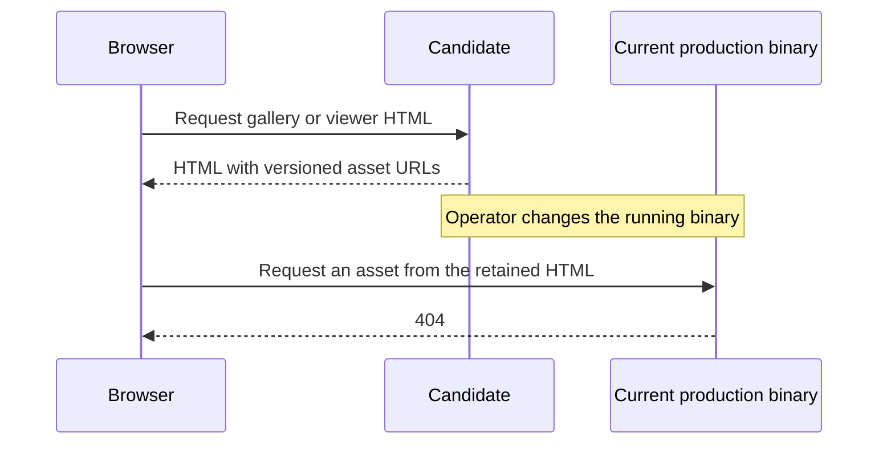

# Web interface QA, 2026-10-05

Hold promotion of the complete experiment branch. The browser checks pass, but rolling back to the current production binary breaks pending requests for all 10 versioned assets. The four changes to search, anchored feedback, optional work, and collection rendering remain good candidates for a separate release.

This QA used `/mnt/nas/Dev/worktrees/artifact-mcp-web-perf-20261005`, branch `perf/web-interface-prod-20261005`. Application source was commit `daf7c52`. The native candidate binary was unchanged, with SHA-256 `4e9c638c7f27a96190b17c4b75e4f9d9b6e59c976b150419e3c7ad7a13a2222a`. The rollback target was the previously verified copy of production commit `13be8f7b4aaad0a29360a658b258969bb9ccba4d`, version 1.11.2. All servers, identities, credentials, organizations, content, and speech workers used for these checks were temporary local fixtures. Production and the original development checkout were unchanged.

## Fresh checks

| Check | Coverage | Result |
| --- | --- | --- |
| Gallery interactions | Chromium; Node and Rust; 24 artifacts and three collections per runtime | 12/12 cases passed |
| Cross-browser workflows | Firefox 150.0.2 and WebKit 26.4; Node and Rust; 1440×900 and 390×844 | 8/8 scenarios passed |
| Saved and draft anchor geometry | Chromium; Node and Rust; actual UI selections; 1440×900, 1024×768, and 390×844 | 60/60 position checks passed |
| Viewer recovery and bundle navigation | Chromium; Node and Rust; delayed shell, scrolling, resize, state, discussion, voice, reader | 8/8 cases passed |
| Committed performance regressions | Chromium; Node and Rust | 10/10 tests passed |
| Asset delivery | All 10 assets on each runtime; bytes, hashes, MIME types, validators, HEAD, invalid paths | Passed |
| Proxy policy | Local cache and compression emulation; 10 assets | Passed locally; production proxy untested |
| Rollback compatibility | Candidate asset URLs requested from the copied production binary | 10/10 returned `404`; release blocker |

Gallery checks covered search followed by open/back before the 150 ms save timer, filter and sort changes during a held collection refresh, collection membership changes and rename, favorite propagation, selection, and deletion. The inactive All artifacts view did not create collection card copies. Both runs captured zero console errors, page errors, transport failures, or unexpected HTTP errors. See [Node](evidence/qa-20261005/gallery-node.json) and [Rust](evidence/qa-20261005/gallery-rust.json).

The Firefox and WebKit scenarios exercised search, sort, card menus within the viewport, all four collection layouts, a deferred shell held until the raw iframe loaded, an early state handshake, saved-anchor startup, Details, voice discovery, real PCM playback, and saved-position resume after reload. Every scenario captured zero console errors, page errors, transport failures, or HTTP errors. Details used a local response fixture because these servers had no Discord configuration. See the [cross-browser results](evidence/qa-20261005/cross-browser.json).

The geometry check created a saved comment through the real selection UI, then made an unsaved selection in another paragraph. It compared the saved box and draft box with the raw element's position and size after five scroll positions in each of three viewports. All 60 comparisons were within two CSS pixels. The draft composer stayed within the viewport, and both runtime scenarios captured zero console, page, transport, or HTTP errors. See [geometry results](evidence/qa-20261005/anchor-geometry.json) and the [phone draft screenshot](evidence/qa-20261005/rust-real-draft.png). These checks establish position recovery after scroll and resize; they do not measure scrolling frame rate.

The final viewer recovery run used a real selection envelope for a bundle page, followed its relative link, and checked saved marker geometry through sustained scrolling and desktop, tablet, and phone resizing. It also checked discussion failure followed by retry and cached success, disabled and failed voice discovery, and reader save/resume with the shell held during reload. Both runtimes completed four cases with zero defects or unexpected console, page, transport, or HTTP errors. Intentional missing-state reads and injected `503` responses were checked separately. See [viewer results](evidence/qa-20261005/viewer.json), [desktop bundle](evidence/qa-20261005/rust-bundle-page-two.png), and [phone bundle](evidence/qa-20261005/rust-bundle-390.png).

The committed regression tests also exercise disabled and failed voice discovery. QA corrected their selector from the nonexistent `#vreader` to `.vreader`, asserted that the reader section exists, and waited for the voice response before checking visibility. The previous hidden-element assertion could pass without checking the actual section. All 10 tests passed after this correction. See the [test log](evidence/qa-20261005/regression-tests.txt).

Desktop and phone screenshots were inspected. Gallery controls, card menus, viewer actions, and the compact audio player remained usable. The gallery fixture deliberately had no preview renderer and displayed its existing placeholder. Browser controls retain some engine-specific styling. These are Linux browser-engine checks with viewport and touch emulation; they do not establish physical iPhone or macOS Safari behavior.

| Gallery | Viewer |
| --- | --- |
| [Firefox desktop](evidence/qa-20261005/rust-firefox-1440-gallery.png) | [WebKit desktop](evidence/qa-20261005/rust-webkit-1440-viewer.png) |
| [Firefox phone viewport](evidence/qa-20261005/rust-firefox-390-gallery.png) | [WebKit phone viewport](evidence/qa-20261005/rust-webkit-390-viewer.png) |

## Asset release blocker

The candidate serves exact allowlisted files with full SHA-256 ETags, `nosniff`, and `public, max-age=31536000, immutable, no-transform`. Both runtimes returned bodyless `304` responses for conditional requests and bodyless `200` responses for HEAD. Wrong digests, unknown files, and traversal requests returned `404`. See [asset evidence](evidence/qa-20261005/assets.json).

The decisive release test retained the candidate's asset URLs, then requested them from the copied production binary. All 10 returned `404`. A browser can already have candidate HTML when the server rolls back, then request a deferred script or stylesheet. Replacing the binary atomically does not remove this window. The candidate also serves only its current asset manifest, so future updates need to retain old asset versions.

See the [rollback evidence](evidence/qa-20261005/rollback.json). A successful warm cache does not close this gap for a new browser or a cache miss.

The initial compression emulator transformed responses without honoring `no-transform`. That probe does not represent deployment policy and is excluded from the committed asset evidence. The corrected emulator honored `no-transform`, sent no Brotli or gzip content encoding, and served warm cache requests without another origin fetch. Ten distinct asset keys caused ten origin requests. See the [corrected proxy evidence](evidence/qa-20261005/proxy-policy.json). No candidate request passed through the real Cloudflare route, so no production cache or compression improvement is claimed.

## Promotion decision

| Option | Required work | Recommendation |
| --- | --- | --- |
| Release the other four changes with assets inline | Prepare that release variant and rerun startup, viewer, and reader checks | Smallest immediate release path |
| Release all five with a compatible rollback binary | Add the exact candidate assets and route to the frozen production source; verify delayed asset requests across both transitions; retain compatibility for the rollback window | Appropriate if asset caching must ship now |
| Serve retained assets from an independent origin or proxy | Add asset storage, exact path routing, version retention, monitoring, and deployment checks | Consider for the longer-term release process |

Neither release variant was built or deployed in this QA task. Do not promote `daf7c52` directly with the unmodified production binary as its rollback target. Keep the content-visibility experiment and pagination outside this release. The original [performance report](web-interface-20261005.md) remains the source of the measured before/after results; this QA does not add production latency measurements.

## Test setup corrections

The shared reader fixture creates a publisher key without an organization record. Gallery QA added the organization through the normal local Settings API before creating collections. Its initial `404` responses were fixture setup failures.

The host had no running audio output and lacked WebKit audio plugins. The initial Firefox and WebKit audio clocks stayed at zero. QA downloaded browser dependencies into `/tmp`, ran a temporary PulseAudio output that discards sound while advancing the playback clock, and loaded local GStreamer plugins for WebKit. The final playback checks used progressing audio clocks and verified saved offsets after actual playback of fixture audio. No application playback code or host packages changed. The temporary audio process and local servers were stopped after the checks.
