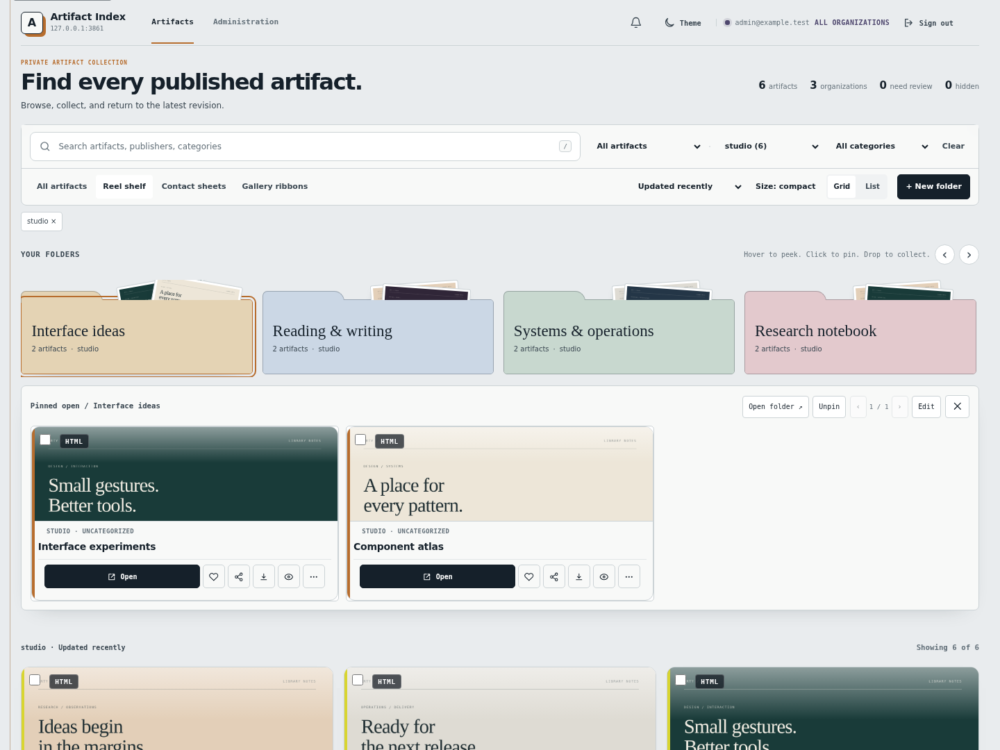
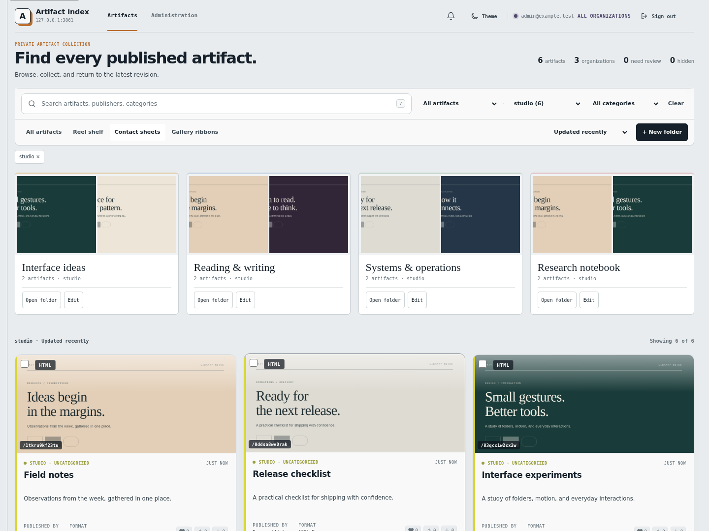
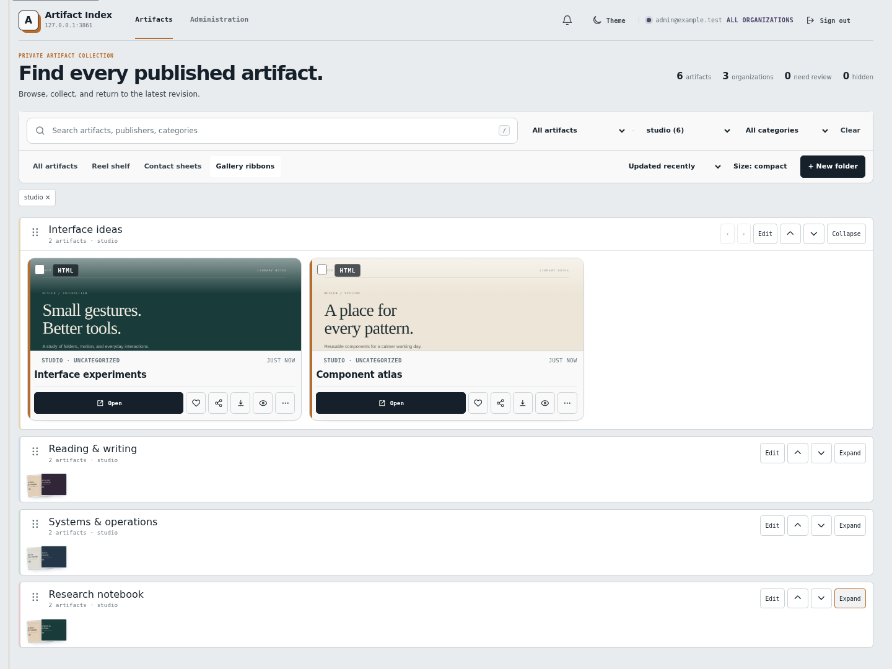
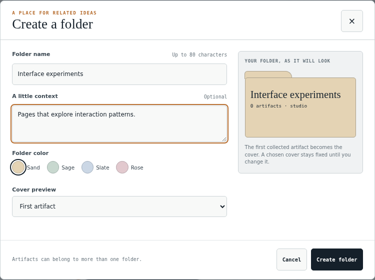
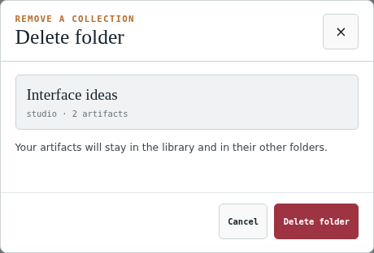

# Artifact MCP v1.12.0

## Organization folders through MCP

MCP clients can now manage the organization folders shown in Reel Shelf, Contact Sheets, and
Gallery Ribbons. The seven organization-scoped tools list, inspect, create, update, and delete
folders, and add or remove artifact references. The three library presentations continue to share
the same memberships. Adding or removing a reference does not change artifact content, revisions,
categories, visibility, organization, or public shares. Deleting a folder preserves its artifacts
and their memberships in other folders.

Folder reads require `artifacts:read` for OAuth credentials. Folder creation and all folder
mutations, including deletion, require `artifacts:publish`. API-key folders belong to the stable
API-key client ID. OAuth folders belong to the configured issuer and client ID together. The API-key
owner email is not used as the MCP actor. Browser-created folders retain their verified email
ownership. Administrators can curate folders in authorized organizations; readers remain read-only.

This release retains the reviewed action-grant support from v1.11.2, including its configured
pilot actions and validation rules.

## Folder dialog polish

Create and edit now use the approved two-column folder editor, with a live folder preview,
name, optional context, named color swatches, and a cover selector. Small screens keep the
header and actions visible while the editor body scrolls. The preview remains readable in
both themes, including custom folder colors.

Administrators choose from registered organizations. The admin login identity is no longer
inserted as a folder organization. Creating a folder from selected artifacts keeps their
organization fixed. Cancel, Close, and Escape dismiss forms without validation or writes.

Deleting a folder now opens an in-app confirmation with its name, organization, and artifact
count. Cancel receives initial focus. Failed requests keep the confirmation open for retry.
The dialog states that artifacts remain in the library and in their other folders.

Administration and revision restore also use in-app confirmations with explicit action labels
and keyboard cancellation. This covers organization deletion, key revocation, discussion
credential and destination removal, webhook removal, and saved-connection changes.

## UI screenshots

These captures use the released Rust binary with fictional artifacts in an isolated server.
The three library views share folder memberships.

| Reel Shelf | Contact Sheets | Gallery Ribbons |
|---|---|---|
|  |  |  |

| Create a folder | Delete a folder |
|---|---|
|  |  |

See the [mobile folder editor](../screenshots/14-folder-create-mobile.png) and the
[full screenshot gallery](../screenshots/README.md) for capture details.

## Schema and configuration

The schema advances from 37 to 38. Migration 038 adds the typed `created_by_kind` column to
`collections`, with the existing email rows preserved as `email`. New rows identify browser email,
API-key client ID, or the canonical OAuth issuer and client ID pair. Startup applies the migration
automatically after the earlier migrations.

No new environment variables are required for folder tools. Existing OAuth configuration is used;
OAuth deployments must issue the `artifacts:read` and/or `artifacts:publish` scopes required by the
requested operation. Existing API-key organization and role configuration remains compatible.
Folder and membership reads remain bounded: pages default to 25 and accept 1 to 100 rows,
organizations support up to 200 folders, folders support up to 1,000 memberships, and one
membership request accepts up to 100 artifact IDs. See the [MCP API reference](../mcp-api.md).

## Deployment and rollback

Before upgrading, verify the release checksums and attestations. Back up and test recovery of the
database, artifact bodies, previews, and configuration. Keep the current binary and deployment
record so the operator can restore the prior release. Let the service apply migration 038 during
startup, then verify health, schema 38, authenticated folder reads, one folder mutation, and all
three library presentations.

Migration 038 is additive, but it is not a complete downgrade plan. A pre-v1.12.0 binary does not
provide the MCP folder tools and does not understand service-principal ownership. If an operator
must roll back before schema 38, stop writes, preserve the schema-38 database and artifact files,
and verify the older binary against a copy or a tested recovery procedure before using it. Do not
assume that an older binary will safely preserve or authorize API-key and OAuth-owned folders.
Never restore an older full database backup over artifact writes made after the backup.

## Validation

Release CI validates the Node and Rust implementations, shared tool definitions, permissions,
pagination limits, migration fixtures, cross-runtime HTTP conformance, and browser behavior across
Reel Shelf, Contact Sheets, and Gallery Ribbons. The folder workflow also verifies that deleting a
folder leaves its artifacts available.

## Vulnerability exceptions

None declared.
