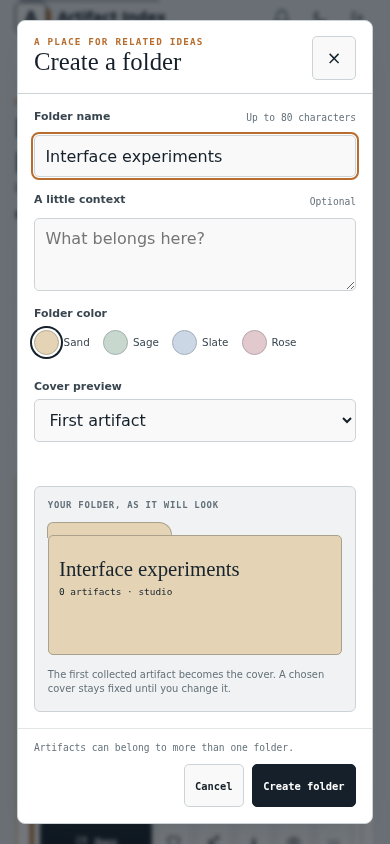
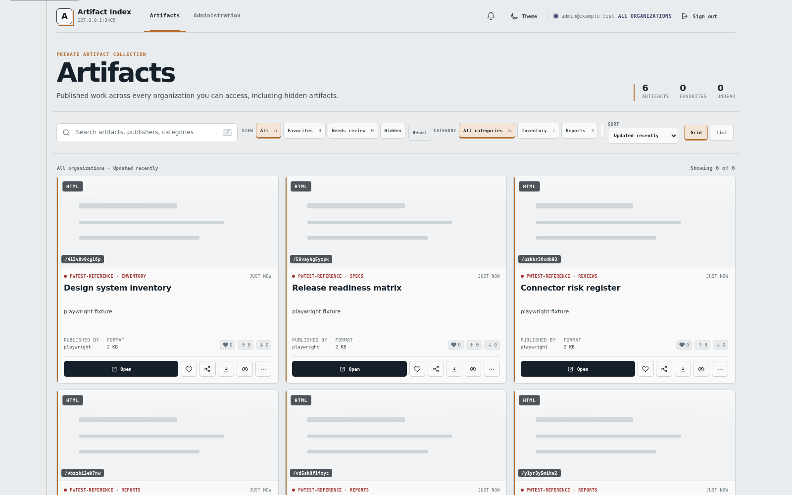
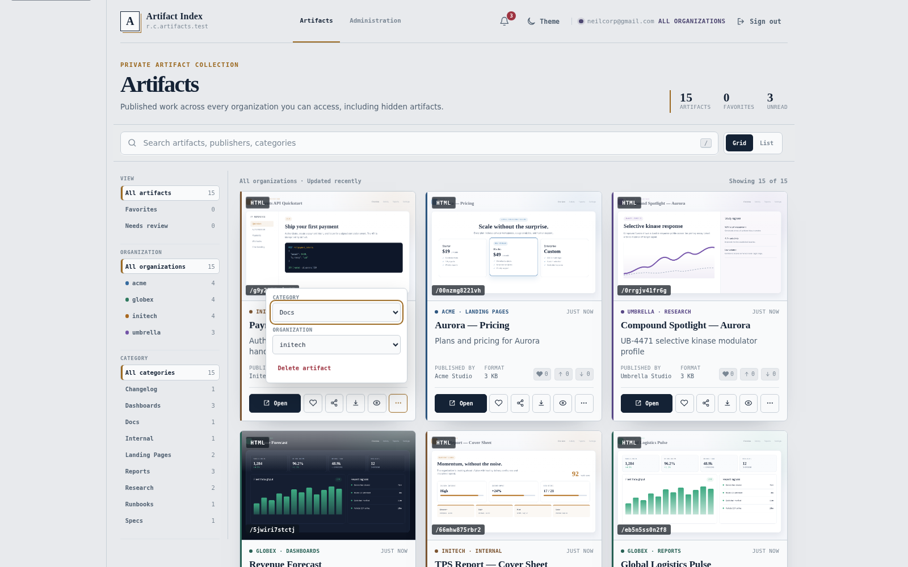
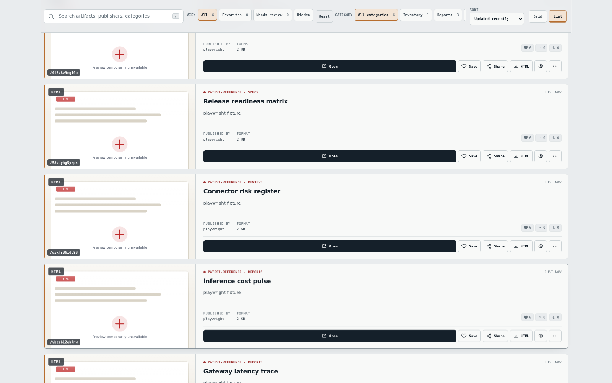
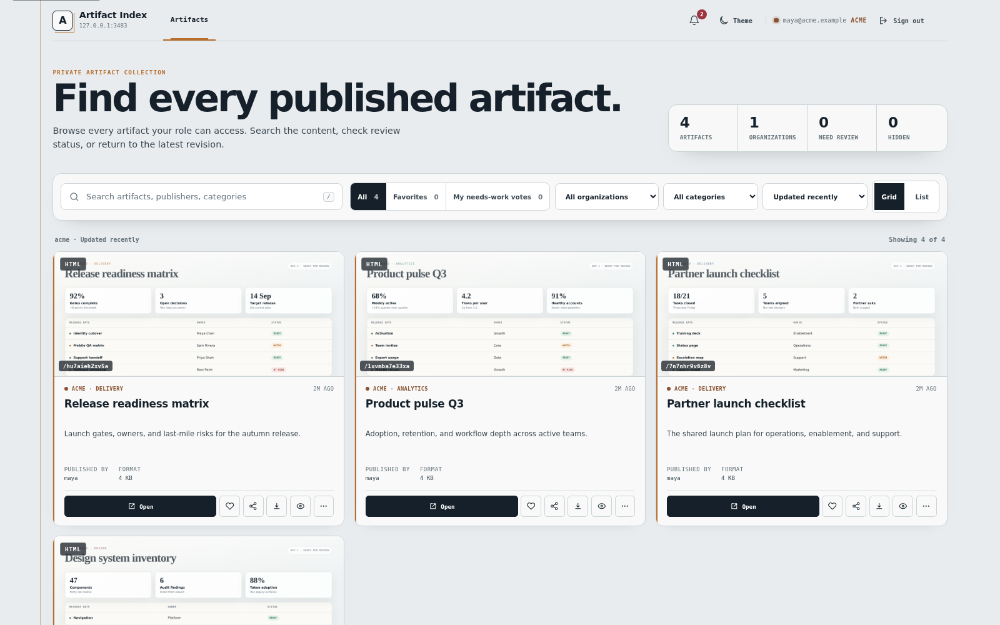
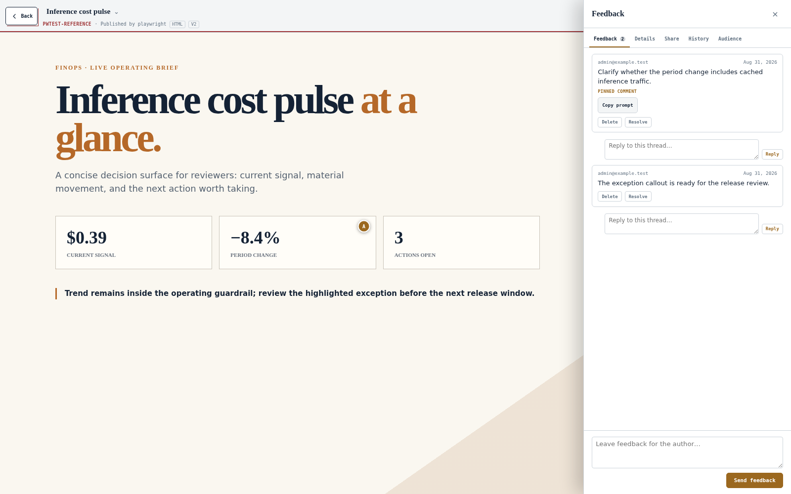
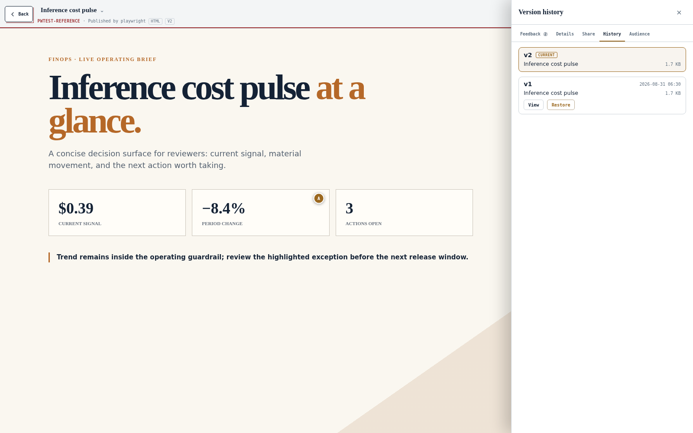
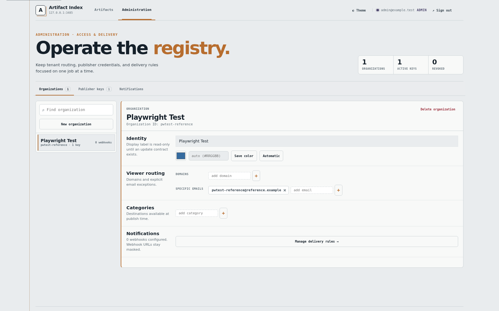
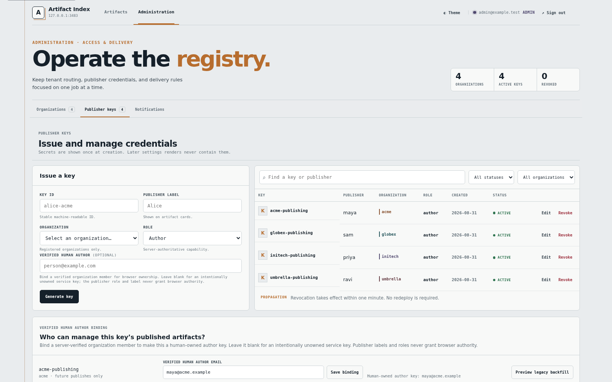

# Screenshot gallery

Screenshots 09–14 show the published Rust v1.12.0 binary at schema 38 in an isolated local server.
The library contains six fictional artifacts in the `studio` organization and four folders.
The artifact previews were captured from those demo pages. No production data or credentials
appear in these images. These examples use the shipped light theme.

Desktop captures use Chrome 146.0.7680.71 at 1440 × 1080 with a device scale factor of 1 and reduced motion.
The folder dialogs are cropped to their rendered bounds. The mobile example uses a 390 × 844
viewport; it demonstrates browser viewport emulation, not a physical device test. Captures wait
for fonts, decoded previews, and the gallery loading placeholders to clear.

| Reel Shelf | Contact Sheets |
|---|---|
|  |  |
| Hover to peek, click to pin, and drag artifact cards onto folders. | Each folder cover shows several artifact previews. |

| Gallery Ribbons | Create a folder |
|---|---|
|  |  |
| Reorder folders with drag or arrow controls. Collapsed ribbons retain a preview fan. | Set the name, optional context, color, and cover while viewing the folder preview. |

| Delete a folder | Mobile folder editor |
|---|---|
|  |  |
| The confirmation identifies the folder and explains that artifacts remain available. | The body scrolls while the header and action buttons remain visible. |

## Earlier product captures

Screenshots 01–08 come from an isolated Rust v1.7.2 release-candidate server at schema 32. That
server contains twelve fictional artifacts across test organizations with the optional preview
renderer enabled. These images cover review, version history, and organization administration;
the folder library and dialogs above show the current v1.12.0 behavior.

| Administrator gallery | Card actions |
|---|---|
|  |  |
| Search, quick views, organization and category filters, sorting, and layout controls share one toolbar. | Change category or organization in place. Deletion remains explicit and confirmed. |

| List layout | Member gallery |
|---|---|
|  |  |
| The list keeps previews, metadata, and controls readable for dense collections. | Members see organization-scoped counts, filters, and ownership controls for their own uploads. |

| Anchored review | Version history |
|---|---|
|  |  |
| The inspector holds threaded point and region feedback beside the sandboxed artifact. | Browse retained revisions or restore an older body as a new revision. |

| Organization administration | Publisher credentials |
|---|---|
|  |  |
| Manage routing, colors, categories, members, and delivery settings for one organization. | Issue and revoke scoped keys, assign an owner, and preview legacy-owner backfills. |

[Return to the README](../../README.md).
