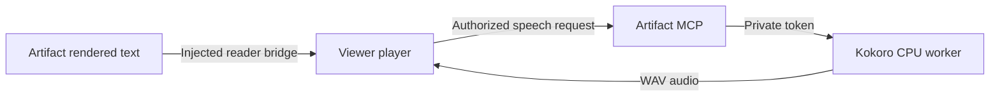

# Native artifact narration

The authenticated viewer can narrate rendered text from any HTML artifact,
including bundle pages. Playback controls live in the viewer; artifacts need no
embedded player or speech code. This optional feature is disabled by default.

The September 2026 trial uses Kokoro v1.0 on CPU for the private 1984 reader.
Artifact MCP remains native in CT220. A separate Compose worker runs on VM310.
No Cloudflare routes or artifact sandbox permissions change.

### Pocket-only profile

To retire the GPU-backed Qwen route while keeping the CPU Pocket worker, install
`pocket-only.conf` as a drop-in for `artifact-mcp.service` and restart the
service. The profile clears Kokoro, Qwen, MOSS, and Qwen feature flags from the
effective service environment; existing `POCKET_TTS_WORKER_URL` and token-file
settings remain in force. The voices endpoint then reports Pocket’s 21 voices,
and requests using a Qwen voice return `400 bad_voice`.

## Worker

Build `Dockerfile` and run `docker compose up -d` in a dedicated deployment
directory. Set `TTS_BIND_HOST` to the private host interface and `TTS_SUBNET` to
an unused Docker subnet. Place model files under `models/`, verify them against
`model-manifest.json`, and create `cache/` owned by UID 65532. The default model
is `kokoro-v1.0.onnx`; the smaller int8 export was slower in this trial.

Generate a random token of at least 32 characters in `tts-token`, readable only
by the worker UID and the operator. Copy it securely into the artifact server's
credential directory. Never put the token in HTML, source, or command arguments.

The worker has a 2 CPU quota, 2 GiB memory cap, 96 PID cap, read-only root, no GPU,
and a 512 MiB FIFO audio cache. Its temporary directory must permit executable
library mappings because phonemizer copies eSpeak's native library there.
The build context excludes credentials, models, and cached audio.

`GET /health` verifies model loading. `POST /speech` accepts authenticated JSON
with only `text` and `voice`; a busy worker returns 429. There is one inference
at a time. Logs contain timings and sizes, never source text or credentials.
Audio remains in the private cache until size eviction or operator removal.

## Artifact server

Configure the artifact service and restart it after installing the feature:

```text
TTS_WORKER_URL=http://PRIVATE_WORKER:8788
TTS_WORKER_TOKEN_FILE=/etc/artifact-mcp/tts-token
TTS_ENABLED=1
```

An optional `TTS_ARTIFACT_IDS` comma-separated allowlist limits narration to
selected artifacts. An existing allowlist also keeps the earlier trial enabled
when `TTS_ENABLED` is unset. Remove the allowlist and set `TTS_ENABLED=0` to
disable narration. The token file must be readable by the artifact service
account. Both routes
reuse viewer authorization; synthesis also passes the existing same-origin
mutation gate. Requests are limited to 1500 Unicode characters and 8 KiB JSON.
Responses are limited to 4 MiB WAV with a 60-second timeout and no redirects.

- `GET /{id}/speech/voices` returns enabled status, fixed voices, and maxChars.
- `POST /{id}/speech` accepts `{text, voice}` and returns private, uncached WAV.

The viewer's **Listen** control opens the player. Choose the current page,
selected text, or text from the current reading position. Play/pause, stop,
paragraph navigation, voice selection, and playback speed stay in the trusted
viewer. The player requests bounded chunks and preloads one ahead.



The server injects the shared `assets/reader-bridge.js` helper only into HTML
requested by the viewer with `reader=1`. Its bounded `reader:*` messages carry
text and highlight IDs across the sandbox. Both ends check the source window.
The artifact receives no worker credentials or general network access. The
iframe's existing content security policy remains unchanged.

Extraction prefers visible article/main content, skips navigation, forms, and
hidden text, and supports ordinary text when no semantic container exists.
Authors can exclude auxiliary content with `data-artifact-readable="false"`.
Selection mode reads the selected text. Page mode reads the currently rendered page, including content below the fold.
For the supported ereader format, it reads chapter headings and book paragraphs,
then uses the existing Next link to continue into the next chapter automatically.
Manual navigation stops playback. Generic pages do not automatically follow links.
It does not interpret canvas graphics or images.

The ereader adapter recognizes a `script#book` JSON object with a `chapters`
array. Chapters have `part`, `title`, and `blocks` containing `t` and `s` fields.
The rendered `article#article` contains `.ch-head .part`, `.ch-head h1`, and
`p[data-p]` paragraphs. Chapter navigation uses `.ch-nav .next[data-go]` with
the next zero-based chapter index. Matching the heading and first paragraph
confirms the current chapter before the adapter follows that link.

## Navigation and compact playback

Open **Listen**, then click a paragraph or heading in the artifact. A short
excerpt and **Read from here** action appear in the player. The chosen paragraph
gets a soft dashed highlight, and a 44-pixel play button appears beside the text.
The button follows scrolling, avoids the player, and hides while the target is
offscreen. Starting playback or dismissing the choice clears this temporary
highlight. The solid playback highlight continues to mark the paragraph being read. Choosing the action
starts at that paragraph; clicking text alone does not interrupt playback.
Links, buttons, form fields, editable text, and text selections keep their normal
behavior. Reading suggestions are disabled while the viewer is placing comments.

The **Jump to** menu lists headings and semantic sections. Choose an entry and
press **Read** to start there and continue through the remaining page. Supported
ebooks also list their chapters, including while the cover is displayed. Chapter
jumps use the book's existing Contents controls. Stale paragraph positions are
rejected if the readable text changed after selection.

**Listen** opens the compact player at the bottom of the viewer without starting audio.
**Expand** opens voice, speed, reading scope, and other settings. **Minimize** returns
to the compact player without interrupting audio. It includes pause/resume, 15-second rewind, next paragraph, and
**Expand**. Its close button stops audio and saves the current place. Click-to-read
suggestions also appear in the compact bar. Clicking Listen while settings are open
returns to compact playback.

## Listening controls

The shared player supports **This section** for ordinary HTML, using the clicked
readable block or the first visible block. Semantic `section` containers define
scope; otherwise headings divide the page. Pages without either use the whole
readable area. Section mode stops at its boundary, including in ereaders.

**Resume saved place** is explicit and stores a small checkpoint in this browser,
separately for each viewer, artifact, and bundle page. It remembers paragraph,
chunk, audio offset, voice, speed, and reading scope; it does not store source text.
Reload the artifact and choose Resume to continue. The bridge verifies a content
fingerprint and refuses stale positions. Supported ereaders can restore a chapter
through their existing Contents controls (`#t-contents` or `[data-panel="contents"]`,
then `.toc [data-go]`). Selection and paragraph previews do not replace saved places.
Browser storage clearing removes these checkpoints; they do not sync across devices.

**Rewind 15 seconds** reuses buffered streaming audio within the current chunk.
Cross-chunk rewind uses known completed durations and requests the earlier audio
again, normally from the worker cache. It clamps to the available reading history.
If cached audio has been evicted, regeneration can sound slightly different.

The **Sleep timer** offers 15, 30, or 60 minutes, or the end of the current section.
End of chapter appears after a supported chapter is extracted. Timed sleep uses
wall-clock time, including pauses; expiry stops playback and saves the position.
The player checks the deadline again when a background tab becomes visible.
No audio download controls are included.

Public share links and standalone raw downloads do not gain a player. Speech
routes require the same organization authorization as the artifact. The Node
reference server and native Rust server implement the same viewer integration.

## Models and licenses

- Kokoro weights and voice data: [Kokoro-82M model card](https://huggingface.co/hexgrad/Kokoro-82M), Apache-2.0.
- ONNX exports: [kokoro-onnx v1.0 model files](https://github.com/thewh1teagle/kokoro-onnx/releases/tag/model-files-v1.0).
- kokoro-onnx wrapper: [upstream repository](https://github.com/thewh1teagle/kokoro-onnx), MIT.
- eSpeak NG pronunciation library: GPL-3.0-or-later; installed from Debian.

These are model/runtime licenses; they do not grant rights to books being read.

## Verification and rollback

Run focused Rust speech tests, JavaScript syntax validation, worker auth/input
checks, and browser playback against the real worker before deployment.
The viewer must support pause/resume, cancellation, next paragraph, voice changes,
and visible failure recovery without changing annotations or shared state.

Reader control regression fixtures use the release binary and Playwright:

```sh
node playwright/tests/reader-sections.cjs
node playwright/tests/reader-controls.cjs
node playwright/tests/reader-wav.cjs
```

Set `POCKET_TEST_BINARY` or `WAV_TEST_BINARY` if the release binary lives outside
`target/release/artifact-mcp`. The audio fixtures synthesize deterministic test
buffers in the browser; they do not require model workers. They verify section
scope, stale-content rejection, preview checkpoint isolation, streaming and WAV
rewind, explicit resume, timer expiry, and end-of-section prefetch boundaries.

Keep the old native binary before rollout. To disable, clear the allowlist, set
`TTS_ENABLED=0`, and restart Artifact MCP. Restore the prior native binary if
needed. Artifact source does not need to change. `docker compose down` stops only this worker;
it preserves models and cached audio.
